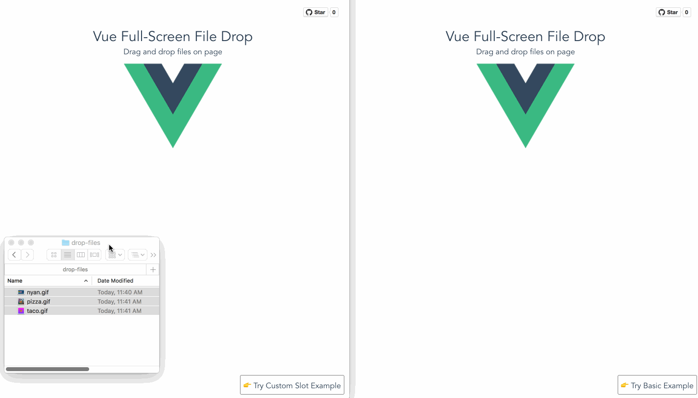

# Vue Full Screen File Drop [](https://travis-ci.org/crcatala/vue-full-screen-file-drop)

> a Vue.js file drop component. Minimal API, you decide what happens after files are dropped.

## Background

Demo: [Try it out!](https://vue-full-screen-file-drop.netlify.com)



## Install

```bash
npm install --save vue-full-screen-file-drop
```

## Usage

### Basic Usage

```javascript
import VueFullScreenFileDrop from 'vue-full-screen-file-drop';
import 'vue-full-screen-file-drop/dist/vue-full-screen-file-drop.css';
```

Then in your template:

```html
<VueFullScreenFileDrop @drop='onDrop'>
```

The `@drop` event has is passed two args.

* `formData` - a [`FormData`](https://developer.mozilla.org/en-US/docs/Web/API/FormData) object that can be used directly to post to server as multipart form. The default field for form is `upload` by default. This can be changed via a prop.
* `files` - a [`FileList`](https://developer.mozilla.org/en-US/docs/Web/API/FileList) object that is part of the [`DataTransfer`](https://developer.mozilla.org/en-US/docs/Web/API/DataTransfer/files) api. Note this is array-like, so may not respond to to typical array methods directly.

```javascript
// Example event handler
onDrop(formData, files) {
  console.log(formData); // Can be posted to server
  console.log(files);    // Can get access to things like file name and size
}
```

### Component Props

| Name          | Type   | Default     | Description                                        |
|---------------|--------|-------------|----------------------------------------------------|
| formFieldName | String | upload      | Form field containing files in the FormData object |
| text          | String | Upload File | Text shown in the drop zone area                   |

### Style Overrides

You can override the styles, see [the css definitions here](dist/vue-full-screen-file-drop.css)

### Custom Slot

If you want to completely define your own drop zone area, this is supported via a slot. You can see an [example here](demo/src/ExampleCustomSlot.vue)

```html
<VueFullScreenFileDrop>
  <div>Some custom content</div>
</VueFullScreenFileDrop>
```

## Development

```bash
# Build main library

npm install
npm run build

# Run demo site in development mode
# Changes picked up from src/VueFullScreenDrop.vue

cd demo
npm install
npm run dev

# Build production demo site
# (build main library first if you want to see updates)

npm install
npm run demo:build

# Testing
npm run test

# Auto watch tests
npm run test:watch
```
